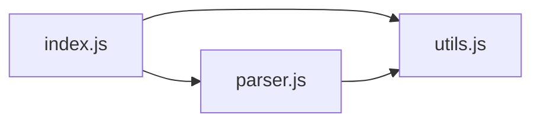

# mermaid-exporter

Exports the current graph as a [Mermaid](https://mermaid.js.org/)
diagram (`.mmd`). Mermaid renders natively in GitHub Markdown, Notion,
Obsidian, GitLab, and many other tools.

## What it does

Adds **"Mermaid Diagram"** as a new option in the export menu.

Clicking it generates a file like:



You can paste this directly into a GitHub README inside a
```` ```mermaid ```` code block, and it'll render as a diagram.

## Install

Copy this folder into your filegraph3d plugins directory:

```
macOS:   ~/Library/Application Support/FileGraph 3D/plugins/
Windows: %APPDATA%\FileGraph 3D\plugins\
Linux:   ~/.config/FileGraph 3D/plugins/
```

Quit and reopen filegraph3d. Open a folder. Open **Settings → Export**
— you'll see "Mermaid Diagram" listed.

## Files

- **`manifest.json`** — declares the plugin as type `exporter` with
  the `export` permission.

- **`main.js`** — registers the exporter. The `generate` function
  receives the graph and returns a Mermaid-format string.

## How it handles ids

Mermaid identifiers must be alphanumeric. The plugin maps every file
path to a safe alias by:

1. Taking the basename: `src/foo/bar.js` → `bar.js`
2. Replacing non-alphanumeric chars with `_`: `bar.js` → `bar_js`
3. Disambiguating duplicates: if two files have the same basename,
   the second becomes `bar_js2`, the third `bar_js3`, etc.

The original path is preserved as the **label** so it's still readable
in the rendered diagram.

## Limitations

Mermaid struggles with very large graphs. Performance gets sluggish
past ~500 nodes; rendering may fail past ~2000.

For large codebases:

1. Use filegraph3d's **active set** feature to mark just the files
   you care about, then export.

2. Or use the [GraphViz DOT exporter pattern](../../docs/types/exporter.md#example-graphviz-dot)
   — GraphViz handles 10k+ nodes well.

## What to change

If you want to customize the output:

### Different layout direction

```js
// Top-to-bottom instead of left-to-right:
const lines = ['graph TB']
```

Options: `TB` (top→bottom), `BT`, `LR` (left→right), `RL`.

### Group by folder

```js
const lines = ['graph LR']
const folders = new Map()
for (const node of graph.nodes) {
  const dir = node.id.split('/').slice(0, -1).join('/') || 'root'
  if (!folders.has(dir)) folders.set(dir, [])
  folders.get(dir).push(node)
}
for (const [dir, nodes] of folders) {
  lines.push(`  subgraph "${dir}"`)
  for (const node of nodes) {
    lines.push(`    ${alias(node.id)}["${basename(node.id)}"]`)
  }
  lines.push('  end')
}
// ... edges
```

### Style by extension

```js
// After declaring nodes:
lines.push('  classDef js fill:#F7DF1E,stroke:#000')
lines.push('  classDef ts fill:#3178C6,stroke:#000')
for (const node of graph.nodes) {
  lines.push(`  class ${alias(node.id)} ${node.ext}`)
}
```

## License

MIT.

## More

See [../../docs/types/exporter.md](../../docs/types/exporter.md) for
the full exporter guide, including more output formats (GraphViz,
custom JSON) and patterns for handling the active set.
